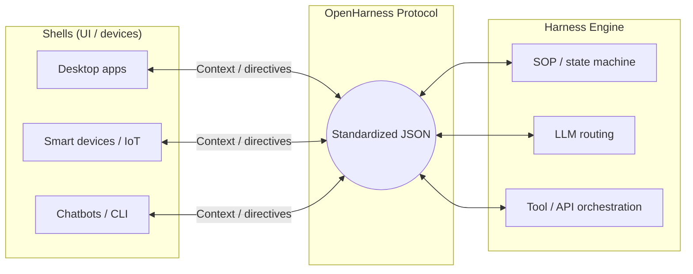

# OpenHarness Protocol

**The universal standard for headless agentic gateways** — a device-agnostic, LLM-agnostic JSON contract between **Shells** (clients / devices) and **Harness Engines** (orchestration, models, tools).

[](./docs/PROTOCOL.md)
[](https://opensource.org/licenses/MIT)
[](http://makeapullrequest.com)

<!-- GitHub README is static: no JavaScript, so there are no real toggle buttons. Use the links below to jump to each language block. -->
<p align="center">
  <a href="#readme-en"><strong>English</strong></a>
  &nbsp;·&nbsp;
  <a href="#readme-zh">中文</a>
</p>

<a id="readme-en"></a>

## Documentation

| | Link |
|---|------|
| **Protocol (English, normative)** | [docs/PROTOCOL.md](./docs/PROTOCOL.md) |
| **协议（中文，对照译文）** | [docs/PROTOCOL.zh.md](./docs/PROTOCOL.zh.md) |
| **Scope & boundaries (informative)** | [docs/SCOPE.md](./docs/SCOPE.md) |
| **Architecture overview (informative)** | [docs/OVERVIEW.md](./docs/OVERVIEW.md) |
| **AI / third-party integration guide** | [docs/guides/AI_INTEGRATION.md](./docs/guides/AI_INTEGRATION.md) |
| **Shell-at-scale integration guide (meta, informative)** | [docs/guides/shell-at-scale.md](./docs/guides/shell-at-scale.md) |
| **Device pairing & long-lived sessions (informative)** | [docs/guides/device-pairing-session.md](./docs/guides/device-pairing-session.md) |
| **Implementer orientation (Shell vs Engine, for AI/humans)** | [docs/guides/implementer-orientation.md](./docs/guides/implementer-orientation.md) |
| **IM/bot Shell profile (informative)** | [docs/profiles/im-bot-shell.md](./docs/profiles/im-bot-shell.md) |
| **HTTP transport hints (informative)** | [docs/profiles/http-transport.md](./docs/profiles/http-transport.md) |
| **Lark/Feishu CLI profile (informative)** | [docs/profiles/feishu-lark-cli.md](./docs/profiles/feishu-lark-cli.md) |
| **Example messages (golden JSON)** | [examples/README.md](./examples/README.md) |
| **Shell-side adapters (optional code, informative)** | [adapters/README.md](./adapters/README.md) |
| **JSON Schema (draft)** | [schema/openharness-v1.draft.json](./schema/openharness-v1.draft.json) |

Unless a file header says otherwise, spec text and schemas in this repository are licensed under the [MIT License](./LICENSE).

**Contributing:** see [CONTRIBUTING.md](./CONTRIBUTING.md). Cursor loads [`.cursor/rules/openharness-protocol.mdc`](./.cursor/rules/openharness-protocol.mdc) for AI-assisted work in this repo.

---

## Vision

**Stop building isolated AI toys. Start building agentic ecosystems.**

Today, compute, models, and UIs are still tightly coupled — every new surface reinvents glue code. OpenHarness breaks that by separating **Shell** (input, rendering, execution) from **Harness Engine** (routing, SOPs, tools, safety). Any desktop app, script, IoT device, or OS node that speaks the protocol can plug into the same engine semantics.

---

## Architecture



- **Device-agnostic input:** Structured JSON context instead of ad-hoc prompt stitching.
- **Engine-side orchestration:** SOP/state machines, tool calls, sandboxing, and routing run in the Harness Engine so Shells stay thin and protocol-focused.
- **Actionable output:** Responses are **action directives** (e.g. UI render, computer-use steps), not only plain text.

---

## Connection scenarios (informative outlook)

The protocol is **transport-agnostic** and does **not** mandate specific vendors. The same **Harness Engine** can back many **Shell** surfaces if each side maps **platform context → `request.context`** and honors **`response` / `action_directives`**. Below are **illustrative** directions — not a product roadmap or interoperability guarantee:

| Surface | Examples | Pointers in this repo |
|---------|----------|------------------------|
| **Enterprise IM / bots** | Feishu / Lark, DingTalk, similar chat platforms | Map tenant/chat/user/thread IDs into `context` per **[im-bot-shell](./docs/profiles/im-bot-shell.md)**; Lark/Feishu Open Platform CLI notes in **[feishu-lark-cli](./docs/profiles/feishu-lark-cli.md)**. |
| **Living room / TV** | Android TV, leanback, remote-driven UI | **[adapters/openharness-adapter-android-tv](./adapters/openharness-adapter-android-tv/)** (guidance). |
| **CLI / agent hosts** | OpenClaw-style runtimes, thin bridges | **[adapters/openharness-adapter-openclaw](./adapters/openharness-adapter-openclaw/)**. |
| **Other clients** | Phones, tablets, IoT, in-vehicle HMI | Use stable **`shell_kind`** / namespacing (PROTOCOL §6); **[shell-at-scale](./docs/guides/shell-at-scale.md)** for where to document large integrations. |

Vendor APIs, OAuth, and transport URLs remain **outside** the normative wire spec; each deployment ships **adapters** and publishes **capabilities** with the Engine team.

**Onboarding (humans / AI agents):** If you are unsure what to build first or whether this repo *is* the TV app, read **[implementer-orientation.md](./docs/guides/implementer-orientation.md)**.

---

## Protocol snapshot (informative)

The normative document is **[docs/PROTOCOL.md](./docs/PROTOCOL.md)**. Below is an illustrative snapshot (`correlation_id`, `shell`, `task_hint`, `continuation`, `attachments`, bidirectional capabilities, `deadline_ms`); full semantics are in the spec.

**Request (Shell → Engine)**

```json
{
  "protocol_version": "1.0.0",
  "request_id": "req_01jqxyz",
  "correlation_id": "corr_8f3a",
  "capabilities": {
    "openharness.actions.parallel": true,
    "openharness.ui.rich_cards": true
  },
  "request": {
    "auth": {
      "tenant_id": "usr_9527",
      "credential_ref": "cred_opaque_abc"
    },
    "context": {
      "session_id": "sess_8848",
      "conversation_id": "conv_tab_2",
      "user_intent": "Continue the onboarding SOP.",
      "task_hint": { "sop_id": "sop_onboard", "business_key": "deal_42" },
      "continuation": { "run_id": "run_7d2", "continuation_token": "ctok_aq9" },
      "shell": {
        "shell_kind": "im_bot_cli",
        "shell_version": "2.1.0",
        "locale": "zh-CN",
        "timezone": "Asia/Shanghai"
      },
      "attachments": [{ "ref_id": "att_01", "mime_type": "image/png" }],
      "environment_state": {
        "privacy_tier": "restricted",
        "os": "macOS",
        "active_window": "Excel",
        "screen_hash": "a1b2c3d4"
      }
    }
  }
}
```

**Response (Engine → Shell)**

```json
{
  "protocol_version": "1.0.0",
  "request_id": "req_01jqxyz",
  "correlation_id": "corr_8f3a",
  "supported_protocol_versions": ["1.0.0"],
  "supported_capabilities": {
    "openharness.actions.parallel": true,
    "openharness.ui.rich_cards": true
  },
  "capability_denials": [],
  "response": {
    "status": "success",
    "engine_latency_ms": 120,
    "action_directives": [
      {
        "action_type": "render_ui",
        "priority": "high",
        "risk_tier": "safe",
        "deadline_ms": 5000,
        "payload": { "component": "DataChart", "data": [] }
      },
      {
        "action_type": "simulate_action",
        "priority": "critical",
        "risk_tier": "dangerous",
        "requires_user_approval": true,
        "payload": { "macro": "cmd+c", "target": "cell_B2" }
      }
    ]
  }
}
```

---

## Enterprise implementations

The OpenHarness **protocol** stays open and free. Production deployments often need hardened sandboxes, compliance, visual SOP authoring, and HA — those are product concerns. Vendors may ship **enterprise gateways** that implement the same wire contract with added SLAs and operations tooling.

<p align="right"><a href="#readme-zh">中文 →</a></p>

---

<a id="readme-zh"></a>

# 中文

<p align="right"><a href="#readme-en">← English</a></p>

**面向「无头智能体网关」的开放 JSON 协议**：在 **Shell**（终端 / 客户端）与 **Harness Engine**（编排、模型、工具）之间，用统一的 JSON 契约通信。**规范以英文为准**；中文对照见 [docs/PROTOCOL.zh.md](./docs/PROTOCOL.zh.md)。

## 文档

| | 链接 |
|---|------|
| **英文规范（权威）** | [docs/PROTOCOL.md](./docs/PROTOCOL.md) |
| **中文对照** | [docs/PROTOCOL.zh.md](./docs/PROTOCOL.zh.md) |
| **范围与边界（资料性）** | [docs/SCOPE.md](./docs/SCOPE.md) |
| **架构总览（资料性）** | [docs/OVERVIEW.md](./docs/OVERVIEW.md) |
| **AI / 第三方集成指引** | [docs/guides/AI_INTEGRATION.md](./docs/guides/AI_INTEGRATION.md) |
| **规模化 Shell 集成指引（元文档，资料性）** | [docs/guides/shell-at-scale.md](./docs/guides/shell-at-scale.md) |
| **设备配对与长期会话（资料性建议）** | [docs/guides/device-pairing-session.md](./docs/guides/device-pairing-session.md) |
| **实现者定向（Shell/Engine、面向 AI/人类）** | [docs/guides/implementer-orientation.md](./docs/guides/implementer-orientation.md) |
| **IM/机器人 Shell Profile（资料性）** | [docs/profiles/im-bot-shell.md](./docs/profiles/im-bot-shell.md) |
| **HTTP 传输提示（资料性）** | [docs/profiles/http-transport.md](./docs/profiles/http-transport.md) |
| **飞书 / Lark CLI 对接提示（资料性）** | [docs/profiles/feishu-lark-cli.md](./docs/profiles/feishu-lark-cli.md) |
| **示例消息（金样 JSON）** | [examples/README.md](./examples/README.md) |
| **Shell 侧适配器（可选代码，资料性）** | [adapters/README.md](./adapters/README.md) |
| **JSON Schema（草案）** | [schema/openharness-v1.draft.json](./schema/openharness-v1.draft.json) |

除文件头另有说明外，本仓库中的规范文本与 Schema 与根目录 [LICENSE](./LICENSE)（MIT）一致。

**贡献：** 见 [CONTRIBUTING.md](./CONTRIBUTING.md)。在本仓库内使用 Cursor 时，会加载 [`.cursor/rules/openharness-protocol.mdc`](./.cursor/rules/openharness-protocol.mdc)，便于 AI 辅助实现与协议一致。

## 愿景

**别再做孤立的 AI 小玩具，来做可协作的智能体生态。**

算力、模型与界面仍高度绑在一起，每次换场景都要重复接胶水代码。**OpenHarness** 把 **Shell**（采集意图、渲染与执行）和 **Harness Engine**（路由、SOP/状态机、工具与安全）拆开：**设备无关、模型无关**，任何桌面应用、脚本、物联网设备或操作系统节点，只要实现协议即可接入同一套引擎语义。

## 架构要点

- **无感输入：** 用标准化 JSON 上下文传递意图，而不是随意拼接 Prompt。
- **引擎侧编排：** 状态机、工具调用、沙箱与路由由 Harness Engine 承担，Shell 保持轻量、专注协议与呈现。
- **可执行输出：** 返回 **行动指令**（如 UI 渲染、Computer Use），而不仅是纯文本。

上图（Mermaid）与英文部分相同：**Shell ↔ 标准化 JSON ↔ Harness Engine**。

## 连接场景展望（资料性）

线格式**与传输、厂商无关**；同一套 **Harness Engine** 可对接多种 **Shell**，只要各自把 **平台上下文映射进 `request.context`** 并处理 **`response` / `action_directives`**。下表为 **方向性举例**，**不构成** 路线图或互操作性承诺：

| 场景 | 举例 | 本仓库中的线索 |
|------|------|----------------|
| **企业 IM / 机器人** | 飞书 / Lark、钉钉、同类协作平台 | **[im-bot-shell](./docs/profiles/im-bot-shell.md)**；飞书 / Lark CLI 见 **[feishu-lark-cli](./docs/profiles/feishu-lark-cli.md)**。 |
| **客厅 / 大屏** | Android TV、遥控器 / Leanback | **[adapters/openharness-adapter-android-tv](./adapters/openharness-adapter-android-tv/)**（指引）。 |
| **CLI / 智能体宿主机** | OpenClaw 等运行时、薄桥接 | **[adapters/openharness-adapter-openclaw](./adapters/openharness-adapter-openclaw/)**。 |
| **其他终端** | 手机、平板、物联网、车机 HMI | 使用稳定 **`shell_kind`** / 命名空间（PROTOCOL §6）；大规模对接见 **[shell-at-scale](./docs/guides/shell-at-scale.md)**。 |

各厂商开放平台、OAuth、具体 HTTP 路径 **不属于** 规范性线格式；每种集成需自研 **适配器** 并与 Engine 约定 **能力真值表**。

**接入顺序（人类 / AI）：** 若不确定先做哪一块、或误以为本仓库即电视 APK，请先读 **[implementer-orientation.md](./docs/guides/implementer-orientation.md)**。

## 协议示例（参考）

完整请求/响应示例见上文 **Protocol snapshot（informative）**（含 `correlation_id`、`shell`、`task_hint`、`continuation`、`attachments`、双向能力与 `deadline_ms` 等）。细则与未知 `action_type` 行为以 **[docs/PROTOCOL.zh.md](./docs/PROTOCOL.zh.md)**（对照 **[docs/PROTOCOL.md](./docs/PROTOCOL.md)**）为准。

## 企业实现

**OpenHarness 协议本身**保持开源与免费。落地到高并发、强合规、复杂遗留系统时，往往需要更强产品与运维能力；各厂商可提供 **企业级网关** 与配套能力（在同一套线格式之上叠加 SLA 与运维工具）。

<p align="center">
  <a href="#readme-en"><strong>English</strong></a>
  &nbsp;·&nbsp;
  <a href="#readme-zh">中文</a>
</p>
