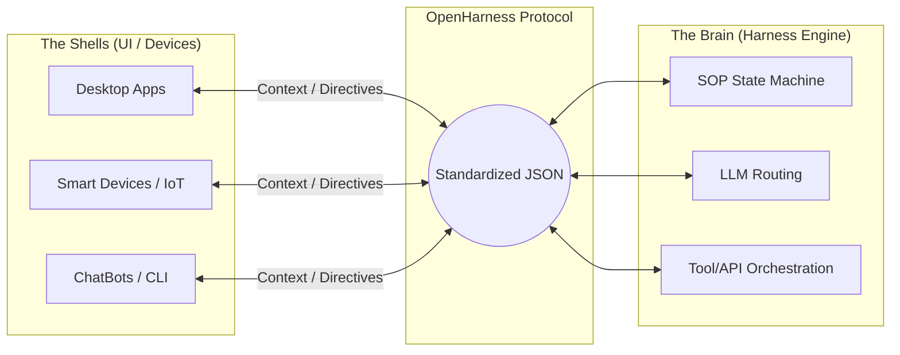

# 🔌 OpenHarness Protocol

**The Universal Standard for Headless Agentic Gateways.**
> 面向“无头智能体网关”的全球通用通信标准。

[](https://github.com/OpenHarness/protocol)
[](https://opensource.org/licenses/MIT)
[](http://makeapullrequest.com)

## 🌐 Vision (愿景)

**Stop building isolated AI toys. Start building Agentic ecosystems.**

当前的 AI 行业正陷入泥潭：算力、模型与终端界面深度耦合，导致每一次场景迁移都在重复造轮子。**OpenHarness 协议旨在彻底打破这一僵局。**

我们提出**“皮囊（Shell）与大脑（Harness Engine）”**的绝对分离。OpenHarness 是一个设备无关（Device-agnostic）、模型无关（LLM-agnostic）的极简通信协议。任何设备——无论是桌面客户端、自动化脚本、智能家居，还是类似方寸OS这样的底层操作系统节点——只要接入本协议，即可瞬间获得极具统治力的业务调度与 AI 代理执行能力。

## ⚙️ Architecture Core (核心架构)

OpenHarness 建立在三大基石之上，确保协议的极简与强悍：


 * Device Agnostic Input (无感输入): 告别传统的 Prompt 拼接，采用标准化的 JSON Context 注入，精准传递用户意图与屏幕/设备状态。
 * Blackbox Orchestration (黑盒编排): 将 SOP 状态机执行、工具调用（Tool/API）、安全沙箱及路由逻辑全部隐藏在 Engine 端。
 * Actionable Output Payload (行动指令集): 抛弃单纯的文本回复，Harness Engine 返回的是结构化的 UI 渲染指令或系统级操作（例如：计算机控制 Computer Use）。
## 🔌 Protocol Specification (协议规范)
(Drafting v1.0.0...)
核心规范定义了 Shell 与 Harness Engine 之间不可篡改的 JSON 契约。以下为核心交互载荷示例：
```json
{
  "protocol_version": "v1.0.0",
  "request": {
    "auth": { 
      "tenant_id": "usr_9527", 
      "api_token": "sk_harness_..." 
    },
    "context": { 
      "session_id": "sess_8848",
      "user_intent": "Analyze the current screen and extract key metrics.", 
      "environment_state": {
        "os": "macOS",
        "active_window": "Excel",
        "screen_hash": "a1b2c3d4..."
      }
    }
  },
  "response": {
    "status": "success",
    "engine_latency_ms": 120,
    "action_directives": [
      { 
        "action_type": "render_ui", 
        "priority": "high",
        "payload": { "component": "DataChart", "data": [...] } 
      },
      { 
        "action_type": "simulate_action", 
        "priority": "critical",
        "payload": { "macro": "cmd+c", "target": "cell_B2" } 
      }
    ]
  }
}
```
 📝 Note: 完整的 RFC 文档与 Schema 校验工具正在积极起草中，欢迎提交 PR 参与标准制定。
 
## 🏢 Enterprise Implementation (企业级商业实现)
OpenHarness 协议永远开源免费。但我们深知，当协议落地于高并发、涉及敏感数据隐私以及需要复杂遗留系统集成的企业级生产环境时，挑战才刚刚开始。
如果您需要：
 * 军工级安全沙箱与 SOC2 合规
 * SOP 可视化编排界面
 * 99.99% 的高可用性保障与私有化部署

**请参阅由 OpenHarness 核心团队维护的企业级网关底座：** 
👉 DeskHarness Enterprise Gateway (Write once with OpenHarness, scale everywhere with DeskHarness.)
