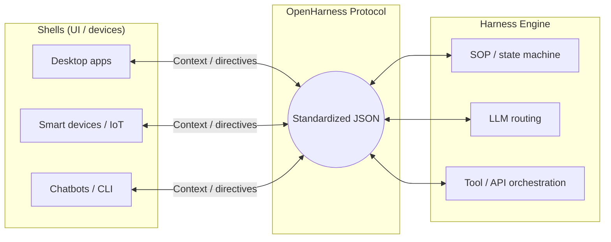

# OpenHarness Protocol

**The universal standard for headless agentic gateways** — a device-agnostic, LLM-agnostic JSON contract between **Shells** (clients / devices) and **Harness Engines** (orchestration, models, tools).

[](./docs/PROTOCOL.md)
[](https://opensource.org/licenses/MIT)
[](http://makeapullrequest.com)

<!-- GitHub README is static: no JavaScript, so there are no real toggle buttons. Use the links below to jump to each language block. -->
<p align="center">
  <a href="#readme-en"><strong>English</strong></a>
  &nbsp;·&nbsp;
  <a href="#readme-zh">中文</a>
</p>

<a id="readme-en"></a>

## Documentation

| | Link |
|---|------|
| **Protocol (English, normative)** | [docs/PROTOCOL.md](./docs/PROTOCOL.md) |
| **协议（中文，对照译文）** | [docs/PROTOCOL.zh.md](./docs/PROTOCOL.zh.md) |
| **JSON Schema (draft)** | [schema/openharness-v1.draft.json](./schema/openharness-v1.draft.json) |

Unless a file header says otherwise, spec text and schemas in this repository are licensed under the [MIT License](./LICENSE).

---

## Vision

**Stop building isolated AI toys. Start building agentic ecosystems.**

Today, compute, models, and UIs are still tightly coupled — every new surface reinvents glue code. OpenHarness breaks that by separating **Shell** (input, rendering, execution) from **Harness Engine** (routing, SOPs, tools, safety). Any desktop app, script, IoT device, or OS node that speaks the protocol can plug into the same engine semantics.

---

## Architecture



- **Device-agnostic input:** Structured JSON context instead of ad-hoc prompt stitching.
- **Black-box orchestration:** State machines, tool calls, sandboxing, and routing live behind the Engine.
- **Actionable output:** Responses are **action directives** (e.g. UI render, computer-use steps), not only plain text.

---

## Protocol snapshot (informative)

The normative document is **[docs/PROTOCOL.md](./docs/PROTOCOL.md)**. Below is a minimal example; versioning, capabilities, privacy tiers, and errors are defined there.

**Request (Shell → Engine)**

```json
{
  "protocol_version": "1.0.0",
  "request_id": "req_01jqxyz",
  "capabilities": { "openharness.actions.parallel": true },
  "request": {
    "auth": {
      "tenant_id": "usr_9527",
      "credential_ref": "cred_opaque_abc"
    },
    "context": {
      "session_id": "sess_8848",
      "user_intent": "Analyze the current screen and extract key metrics.",
      "environment_state": {
        "privacy_tier": "restricted",
        "os": "macOS",
        "active_window": "Excel",
        "screen_hash": "a1b2c3d4"
      }
    }
  }
}
```

**Response (Engine → Shell)**

```json
{
  "protocol_version": "1.0.0",
  "request_id": "req_01jqxyz",
  "supported_protocol_versions": ["1.0.0"],
  "response": {
    "status": "success",
    "engine_latency_ms": 120,
    "action_directives": [
      {
        "action_type": "render_ui",
        "priority": "high",
        "risk_tier": "safe",
        "payload": { "component": "DataChart", "data": [] }
      },
      {
        "action_type": "simulate_action",
        "priority": "critical",
        "risk_tier": "dangerous",
        "requires_user_approval": true,
        "payload": { "macro": "cmd+c", "target": "cell_B2" }
      }
    ]
  }
}
```

---

## Enterprise implementations

The OpenHarness **protocol** stays open and free. Production deployments often need hardened sandboxes, compliance, visual SOP authoring, and HA — those are product concerns. For a maintained enterprise gateway built around the same ideas, see **DeskHarness Enterprise Gateway** (*Write once with OpenHarness, scale everywhere with DeskHarness*).

<p align="right"><a href="#readme-zh">中文 →</a></p>

---

<a id="readme-zh"></a>

# 中文

<p align="right"><a href="#readme-en">← English</a></p>

**面向「无头智能体网关」的开放 JSON 协议**：在 **Shell**（终端 / 客户端）与 **Harness Engine**（编排、模型、工具）之间，用统一的 JSON 契约通信。**规范以英文为准**；中文对照见 [docs/PROTOCOL.zh.md](./docs/PROTOCOL.zh.md)。

## 文档

| | 链接 |
|---|------|
| **英文规范（权威）** | [docs/PROTOCOL.md](./docs/PROTOCOL.md) |
| **中文对照** | [docs/PROTOCOL.zh.md](./docs/PROTOCOL.zh.md) |
| **JSON Schema（草案）** | [schema/openharness-v1.draft.json](./schema/openharness-v1.draft.json) |

除文件头另有说明外，本仓库中的规范文本与 Schema 与根目录 [LICENSE](./LICENSE)（MIT）一致。

## 愿景

**别再做孤立的 AI 小玩具，来做可协作的智能体生态。**

算力、模型与界面仍高度绑在一起，每次换场景都要重复接胶水代码。**OpenHarness** 把 **Shell**（采集意图、渲染与执行）和 **Harness Engine**（路由、SOP/状态机、工具与安全）拆开：**设备无关、模型无关**，任何桌面应用、脚本、物联网设备或操作系统节点，只要实现协议即可接入同一套引擎语义。

## 架构要点

- **无感输入：** 用标准化 JSON 上下文传递意图，而不是随意拼接 Prompt。
- **黑盒编排：** 状态机、工具调用、沙箱与路由放在 Engine 一侧。
- **可执行输出：** 返回 **行动指令**（如 UI 渲染、Computer Use），而不仅是纯文本。

上图（Mermaid）与英文部分相同：**Shell ↔ 标准化 JSON ↔ Harness Engine**。

## 协议示例（参考）

最小请求/响应 JSON 见上文 **Protocol snapshot（informative）** 英文小节。字段语义、版本与兼容、隐私与错误等以 **[docs/PROTOCOL.zh.md](./docs/PROTOCOL.zh.md)**（对照 **[docs/PROTOCOL.md](./docs/PROTOCOL.md)**）为准。

## 企业实现

**OpenHarness 协议本身**保持开源与免费。落地到高并发、强合规、复杂遗留系统时，往往需要更强产品与运维能力。若需要企业级网关与配套能力，可参考核心团队维护的 **DeskHarness Enterprise Gateway**（*Write once with OpenHarness, scale everywhere with DeskHarness*）。

<p align="center">
  <a href="#readme-en"><strong>English</strong></a>
  &nbsp;·&nbsp;
  <a href="#readme-zh">中文</a>
</p>
